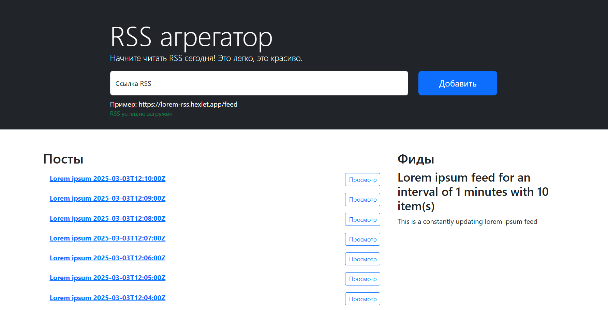

### Hexlet tests and linter status:
[](https://github.com/olesya-syrtina/frontend-project-11/actions)

[](https://github.com/olesya-syrtina/frontend-project-11/actions/workflows/nodejs.yml)

## Rss Reader
Rss Reader — сервис для агрегации RSS-потоков, с помощью которых удобно читать разнообразные источники, например, блоги. Он позволяет добавлять неограниченное количество RSS-лент, сам их обновляет и добавляет новые записи в общий поток.

## Installation
1. Clone the repository
```
git clone git@github.com:olesya-syrtina/frontend-project-11.git
cd frontend-project-11
```
2. 
```
make install
```
3.
```
make develop
```
